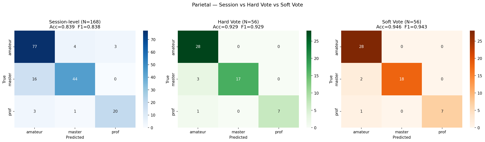
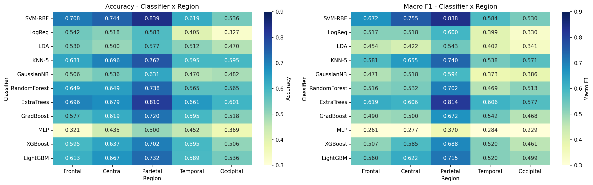

# EEG 圍棋棋力分類

> 從 EEG 腦波訊號分類圍棋選手的棋力等級 — 以功能連結（PLV）與頻帶能量（BE）特徵搭配 SVM，
> 在 57 位受試者上達到 **Accuracy 0.946 / Macro-F1 0.943**（LOSO 交叉驗證）。

**任務**：3 類分類 — `amateur`（業餘低段）/ `master`（業餘高段）/ `prof`（國手）

```
EEG (.set) → PLV / BE 特徵 → 腦區分群 → PCA(0.95) → SVM-RBF → session 預測
                                                                    ↓
                                                    同一受試者 3 session 軟投票
                                                                    ↓
                                                        Acc 0.946 / F1 0.943
```

---

## 核心成果

### 三 session 投票是最大增益來源

同一位受試者的三個 session 各自預測後再合併，準確率從 84% 拉升到 93–95%。



| 評估層級 | N | Accuracy | Macro-F1 |
|----------|:---:|:---:|:---:|
| Session-level | 168 | 0.839 | 0.838 |
| Hard Vote（多數決） | 56 | 0.929 | 0.929 |
| **Soft Vote（機率平均）** | 56 | **0.946** | **0.943** |

### 頂葉（Parietal）區資訊量最高


| 腦區 | Frontal | Central | **Parietal** | Temporal | Occipital |
|------|:---:|:---:|:---:|:---:|:---:|
| Accuracy | 0.708 | 0.744 | **0.839** | 0.619 | 0.536 |
| Macro-F1 | 0.672 | 0.755 | **0.838** | 0.584 | 0.530 |

### PLV 與 BE 互補

| 特徵（Parietal） | Accuracy |
|------|:---:|
| 只用 PLV | 0.738 |
| 只用 BE | 0.708 |
| **PLV + BE 合併** | **0.839** |

合併後的增益遠大於各自的貢獻——兩種特徵描述的是不同面向的神經活動。

### SVM-RBF 在 11 種分類器中最強



固定特徵與流程（PLV+BE、五腦區、PCA 95%、LOSO），只替換分類器。
前段班為 SVM-RBF（0.839）、ExtraTrees（0.810）、KNN-5（0.762）；
線性模型（LogReg 0.583、LDA 0.577）與 MLP（0.500）明顯不適用於這種小樣本高維度的設定。

### beta / delta 頻帶最關鍵

窮舉全部 31 種頻帶子集，**`{delta, alpha, beta}` 達 0.863，優於使用全部五個頻帶的 0.839**。
LOBO 結果一致：移除 gamma 或 theta 反而變好，移除 beta 或 delta 最傷。

---

## 負面結果

用同一批特徵迴歸預測行為指標，**三者都失敗**：

| 目標 | Pearson r | 結果 |
|------|:---:|------|
| 勝率 winrate | −0.001 – 0.079（p > 0.13） | 純粹隨機 |
| 勝步 winstep | −0.074 – 0.059（p > 0.24） | 純粹隨機 |
| 反應時間 RT | 0.19 – 0.44（p < 0.001） | 相關顯著但 **R² 為負** |

**RT 的相關性是假象**：R² 全為負（比猜平均值還差）、預測值幾乎是常數
（各受試者預測平均只落在 22.1–22.3 秒，實際橫跨 21.6–39.3 秒）、
master 內部 LOSO 出現 r = −0.363 的符號翻轉。
正相關來自群體間分布差異，而非模型對個別 trial 的判斷——是「統計顯著但實質無意義」的典型案例。

**分類成功、迴歸失敗**這個對比本身就是結論：這些特徵捕捉的是**穩定的個人專業度**，
而非**當下的表現波動**。

---

## 資料集

57 位受試者（amateur 28 / master 21 / prof 8）、5,096 trials、500 Hz、32 通道、
每 trial 21 秒，分 ss01 開局 / ss02 中盤 / ss03 尾盤三個 session，格式為 EEGLAB `.set` + `.fdt`。

類別不均（prof 僅 8 人），因此同時報告 Accuracy 與 Macro-F1，
並全程使用 **LOSO** 確保同一受試者不會同時出現在訓練與測試集。

完整規格見 **[docs/資料集說明.md](docs/資料集說明.md)**。

> ⚠️ **原始 EEG 與受試者級特徵檔未包含在本 repo 中**（人體實驗資料）。
> Notebook 從本機絕對路徑讀取預先算好的 `.mat` 特徵檔，在其他機器執行需自行調整路徑。
> 從 `.set`/`.fdt` 計算 PLV / BE 的前處理在 MATLAB / EEGLAB 端完成，不在本 repo；
> 本 repo 涵蓋的是**特徵之後**的建模與分析。

---

## 專案結構

| 資料夾 | 內容 |
|--------|------|
| **[SVM_PLV_BE/](SVM_PLV_BE/)** | ⭐ 主要成果：PLV+BE 合併分類、頻帶消融、SHAP 解釋、t-SNE / LDA / KPCA 視覺化 |
| [SVM_PLV/](SVM_PLV/) | 只用 PLV 的分類（基準線）、session 擾動穩健性測試 |
| [SVM_BE/](SVM_BE/) | 只用 BE 的分類（基準線）、session 擾動穩健性測試、資料對齊檢查 |
| [ML_PLV_BE/](ML_PLV_BE/) | 11 種傳統分類器的 Accuracy / F1 比較 |
| [RF_PLV_BE/](RF_PLV_BE/) | Random Forest 版本（單棵樹視覺化、feature importance） |
| [RT1_ms_predict/](RT1_ms_predict/) | 反應時間迴歸（負面結果） |
| [winrate_predict/](winrate_predict/) | 勝率迴歸（負面結果） |
| [winstep_predict/](winstep_predict/) | 勝步迴歸（負面結果） |
| [docs/](docs/) | 資料集規格、完整實驗記錄 |

**建議入口**：[SVM_PLV_BE/svm_plv_be_combined.ipynb](SVM_PLV_BE/svm_plv_be_combined.ipynb) — 最佳結果的完整流程

詳細實驗記錄見 **[docs/專案總覽.md](docs/專案總覽.md)**，
分腦區流程與 PCA 原理見 **[SVM_BE/流程介紹.md](SVM_BE/流程介紹.md)**。

---

## 環境安裝

```bash
python -m venv .venv
.venv\Scripts\activate        # Windows
pip install -r requirements.txt
jupyter lab
```

---

## 授權

程式碼採 [MIT License](LICENSE)。EEG 原始資料與衍生特徵資料不在此授權範圍內。
