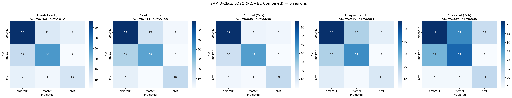
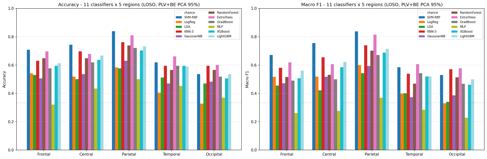
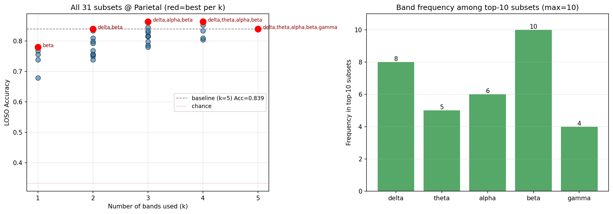

# EEG 圍棋棋力分類

> 從 EEG 腦波訊號分類圍棋選手的棋力等級 — 以功能連結（PLV）與頻帶能量（BE）特徵搭配 SVM，
> 在 57 位受試者上達到 **Accuracy 0.946 / Macro-F1 0.943**（LOSO 交叉驗證）。

**任務**：3 類分類 — `amateur`（業餘低段）/ `master`（業餘高段）/ `prof`（國手）

**方法**：EEG → PLV + BE 特徵 → 依腦區分群 → PCA（保留 95% 變異）→ SVM-RBF → 三個 session 投票

```
EEG (.set)  →  PLV / BE 特徵  →  腦區分群  →  PCA(0.95)  →  SVM-RBF  →  session 預測
                                                                            ↓
                                                          同一受試者 3 session 軟投票
                                                                            ↓
                                                              Acc 0.946 / F1 0.943
```

---

## 核心成果

### 1. 三 session 投票是最大增益來源

同一位受試者的三個 session 各自預測後再合併，準確率從 84% 拉升到 93–95%。


| 評估層級 | N | Accuracy | Macro-F1 |
|----------|----|----------|----------|
| Session-level | 168 | 0.839 | 0.838 |
| Hard Vote（多數決） | 56 | 0.929 | 0.929 |
| **Soft Vote（機率平均）** | 56 | **0.946** | **0.943** |

軟投票下 28 位 amateur 全數正確、8 位 prof 錯 1 位，主要誤差來自 master → amateur。

### 2. 頂葉（Parietal）區資訊量最高

五個腦區各自跑完整流程，Parietal 明顯領先；Occipital 幾乎接近隨機。



| 腦區 | Frontal (7ch) | Central (7ch) | **Parietal (9ch)** | Temporal (6ch) | Occipital (3ch) |
|------|:---:|:---:|:---:|:---:|:---:|
| Accuracy | 0.708 | 0.744 | **0.839** | 0.619 | 0.536 |
| Macro-F1 | 0.672 | 0.755 | **0.838** | 0.584 | 0.530 |

單用 PLV 為 0.738、單用 BE 為 0.708，**合併後跳到 0.839** — 兩種特徵互補，且增益遠大於各自的貢獻。

### 3. SVM-RBF 在 11 種傳統分類器中最強



Parietal 區、PLV+BE、LOSO 下的完整結果（依 Session Acc 排序）：

| 分類器 | Session Acc | Hard Vote | Soft Vote | vs SVM 顯著性 |
|--------|:---:|:---:|:---:|:---:|
| **SVM-RBF** | **0.839** | **0.929** | **0.946** | — |
| ExtraTrees | 0.810 | 0.857 | 0.929 | 不顯著 |
| KNN-5 | 0.762 | 0.893 | 0.929 | 不顯著 |
| RandomForest | 0.738 | 0.804 | 0.786 | 部分顯著 |
| LightGBM | 0.732 | 0.839 | 0.875 | 顯著 |
| GradBoost | 0.720 | 0.750 | 0.821 | 部分顯著 |
| XGBoost | 0.702 | 0.768 | 0.768 | 顯著 |
| GaussianNB | 0.631 | 0.696 | 0.696 | 顯著 |
| LogReg | 0.583 | 0.768 | 0.732 | 顯著 |
| LDA | 0.577 | 0.643 | 0.679 | 顯著 |
| MLP | 0.500 | 0.500 | 0.536 | 顯著 |

顯著性以 **McNemar + Wilcoxon 檢定、Holm 多重比較校正**（α = 0.05）判定：

- **不顯著**（兩種檢定皆未達標）：ExtraTrees（McNemar p = 0.383）、KNN-5（p = 0.052）
- **部分顯著**（McNemar 達標但 Wilcoxon 未達標）：RandomForest、GradBoost（皆 p = 0.058）
- **顯著**：其餘六種模型

也就是說 **SVM-RBF 領先，但相對 ExtraTrees 與 KNN-5 的優勢在統計上站不住腳**——這兩者是同一梯隊的候選模型。
逐項數值見 [ml_plv_be_vote.csv](ML_PLV_BE/ml_plv_be_vote.csv) 與 [ml_plv_be_pvalues_vs_svm.csv](ML_PLV_BE/ml_plv_be_pvalues_vs_svm.csv)。

### 4. beta / delta 頻帶最關鍵，gamma 貢獻最小

窮舉全部 31 種頻帶子集，**`{delta, alpha, beta}` 達 0.863，反而優於使用全部五個頻帶的 0.839**。
beta 出現在 top-10 子集中的全部 10 個，delta 出現 8 次。



LOBO（每次移除一個頻帶）也一致：移除 gamma → 0.863、移除 theta → 0.851（都變好）；移除 beta → 0.804、移除 delta → 0.810（最傷）。

---

## 負面結果（誠實記錄）

用 Parietal 區的 190 維特徵訓練 SVR（在 master 上訓練，預測 amateur 與 prof），
嘗試迴歸預測三種行為指標。**三者都失敗，但失敗的方式不同**：

| 目標 | 資料夾 | Pearson r | 結果 |
|------|--------|:---:|------|
| 勝率 winrate | [winrate_predict/](winrate_predict/) | −0.001 – 0.079（p > 0.13） | 純粹隨機，無任何訊號 |
| 勝步 winstep | [winstep_predict/](winstep_predict/) | −0.074 – 0.059（p > 0.24） | 純粹隨機，無任何訊號 |
| 反應時間 RT | [RT1_ms_predict/](RT1_ms_predict/) | 0.19 – 0.44（p < 0.001） | 相關顯著但 **R² 為負**，見下方說明 |

### RT 的相關性是假象

RT 的相關係數看起來不低（跨群 r = 0.21–0.44，p < 0.0001），但三個證據顯示這**不是真實的預測力**：

1. **R² 全為負**（−0.05 至 −0.22）——模型比直接預測平均值還差。
2. **預測值幾乎是常數**——所有受試者的預測平均都落在 22.1–22.3 秒的極窄區間，
   而實際平均橫跨 21.6–39.3 秒。模型並沒有在區分個體。
3. **Master 內部 LOSO 得到 r = −0.36（p < 0.0001）**——在訓練分布內部，預測與真值呈**負相關**。
   若模型真有預測力，這裡不可能出現這種符號翻轉。

跨群的正相關來自群體間的整體差異（prof 的 RT 分布本就與 master 不同），而非模型對個別 trial 的判斷。
**這是「顯著但無意義」的典型案例——只看 p 值會做出完全錯誤的結論。**

### 為什麼這個負面結果有價值

**分類成功、迴歸失敗**這個對比本身就是結論：這些特徵捕捉的是**穩定的個人專業度**，
而非**當下的表現波動**。同一組特徵能以 94.6% 準確率區分棋力等級，
卻預測不了同一個人某一局的反應時間或勝率。

---

## 資料集

| 項目 | 值 |
|------|------|
| 受試者 | 57 人（amateur 28 / master 21 / prof 8） |
| 總 trials | 5,096 |
| 取樣率 / 通道 | 500 Hz / 36 通道（常用前 32） |
| Trial 長度 | 21 秒（10,500 samples） |
| Session | 3 個（ss01 開局 / ss02 中盤 / ss03 尾盤） |
| 格式 | EEGLAB `.set` + `.fdt` |

類別數量不均（prof 僅 8 人），因此**同時報告 Accuracy 與 Macro-F1**，
並全程使用 **LOSO（Leave-One-Subject-Out）**確保同一受試者不會同時出現在訓練與測試集。

完整規格、檔案命名、讀取方式見 **[docs/dataset_info.md](docs/dataset_info.md)**。

### ⚠️ 資料取得與可重現性

- **原始 EEG 資料與受試者級特徵檔未包含在本 repo 中**（人體實驗資料）。
- Notebook 從本機絕對路徑讀取預先算好的 `.mat` 特徵檔（如 `D:\Tseng\圍棋\`），
  在其他機器執行需自行調整路徑常數。
- **從 `.set`/`.fdt` 計算 PLV / BE 的前處理程式碼不在本 repo**（於 MATLAB / EEGLAB 端完成）。
  本 repo 涵蓋的是**特徵之後**的建模與分析流程。

---

## 專案結構

| 資料夾 | 內容 |
|--------|------|
| **[SVM_PLV/](SVM_PLV/)** | ⭐ 主要成果：PLV+BE 合併分類、頻帶消融、SHAP 解釋、t-SNE / LDA / KPCA 視覺化 |
| [SVM/](SVM/) | 只用 BE 的分類、二分類設定、session 擾動穩健性測試 |
| [ML_PLV_BE/](ML_PLV_BE/) | 11 種分類器比較 + 顯著性檢定（McNemar / Wilcoxon，Holm 校正） |
| [RF_PLV/](RF_PLV/) | Random Forest 版本（單棵決策樹視覺化、feature importance） |
| [game_RT_time/](game_RT_time/) | EEG + 反應時間的多模態分類 |
| [RT1_ms_predict/](RT1_ms_predict/) | 反應時間迴歸（負面結果） |
| [winrate_predict/](winrate_predict/) | 勝率迴歸（負面結果） |
| [winstep_predict/](winstep_predict/) | 勝步迴歸（負面結果） |
| [docs/](docs/) | 資料集規格、專案總覽、成果報告（.docx） |

**建議入口**：[SVM_PLV/svm_plv_be_combined.ipynb](SVM_PLV/svm_plv_be_combined.ipynb) — 最佳結果的完整流程

更詳細的實驗記錄見 **[docs/專案總覽.md](docs/專案總覽.md)**；
分腦區流程與 PCA 原理見 **[SVM/流程介紹.md](SVM/流程介紹.md)**。

---

## 環境安裝

```bash
python -m venv .venv
.venv\Scripts\activate        # Windows（macOS / Linux 用 source .venv/bin/activate）
pip install -r requirements.txt
jupyter lab
```

主要依賴：numpy、scipy、pandas、matplotlib、seaborn、scikit-learn、h5py、shap、xgboost、lightgbm

---

## 授權

程式碼採 [MIT License](LICENSE)。EEG 原始資料與衍生特徵資料不在此授權範圍內。
